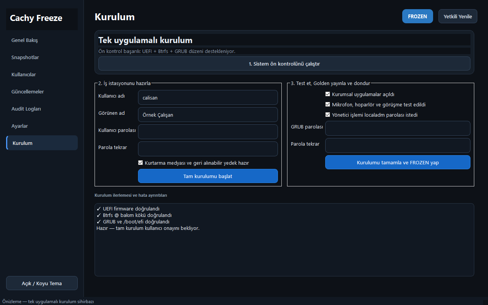

# CachyOS Corporate Laptop Provisioning

This repository provisions CachyOS laptops for shared call-center and sales
workstations. It installs the required applications, creates a restricted
employee account, and restores the machine to a clean **Frozen** state after
every reboot.

> [!IMPORTANT]
> For the complete installation procedure in Turkish, read
> **[KURULUM-TR.md](KURULUM-TR.md)**.

> [!TIP]
> Codex CLI should start the physical CachyOS acceptance from
> **[CODEX-CLI-DEVAM-TALIMATI.md](CODEX-CLI-DEVAM-TALIMATI.md)**. It records the
> verified VirtualBox checkpoint, remaining tests, safety gates, and exact
> continuation order.

> [!CAUTION]
> The application modifies the boot chain, initramfs, GRUB configuration, and
> Btrfs subvolumes. Perform the first installation on a backed-up pilot device
> while you have physical access to it.

## Overview

The project validates the required UEFI, Btrfs, and GRUB layout before making
changes. It then:

- installs the workstation applications;
- creates the managed employee account;
- enables microphone, speaker, headset, video, input, and realtime access;
- requests the `localadm` administrator password for privileged desktop
  actions instead of immediately denying them;
- gives the employee a normal Windows-standard-user-like desktop experience:
  user settings remain available, while system changes require Polkit
  authentication with the `localadm` password;
- starts the employee's Plasma session with the Breeze Dark theme;
- hides `localadm` from the graphical login screen in Frozen mode;
- restores both the employee and `localadm` home directories from clean
  templates during every Frozen boot;
- maintains a Golden Btrfs snapshot from which the active Frozen system is
  recreated;
- records snapshot metadata, checksums, history, health, exports, imports,
  comparisons, cleanup, and rollback counters;
- recovers interrupted Golden/Active transactions and automatically restores
  the previous known-good Golden after repeated failed boots;
- provides one GUI for first installation, dashboards, snapshots, standard
  users, updates, audit logs, boot policy, automatic snapshots, network policy,
  and settings;
- performs privileged work only through a PolicyKit-authenticated allow-list
  helper; passwords use stdin and never appear in process lists;
- displays one GRUB entry whose title reflects the selected mode: **FROZEN**
  or **THAWED**.

## Application preview


The preview is rendered from the real PyQt6 application with representative,
non-production status data. The installed application reads the actual Btrfs,
boot-health, snapshot, update, and audit state from the workstation.

## Codex quick handoff — live CachyOS laptop test

When this repository is reopened for the physical laptop test, start here
instead of redesigning the project:

1. Read `MIMARI-TR.md`, `KURULUM-TR.md`, and `PILOT-NOTLARI.md`; then inspect
   `git status --short` and the latest three commits.
2. Keep the Windows host and CachyOS target strictly separate. Btrfs, GRUB,
   initramfs, snapshot, freeze, and rollback commands may run only on the
   dedicated CachyOS laptop or a disposable CachyOS VM.
3. Before installation, make a recoverable backup and confirm **UEFI + Btrfs +
   GRUB**, `/boot/efi`, and no separate `/boot`. Stop if preflight rejects the
   layout; do not bypass it.
4. Start `CachyOS-Kurulum-Uygulamasi.desktop` and keep the entire
   preflight/provision/test/finalize flow in its **Kurulum** page. This desktop
   launcher is the only supported user-facing installation entry point.
5. Test all seven GUI pages, both `localadm` and a standard user, FROZEN/THAWED
   and one-time THAWED boots, snapshot create/full verify/rollback, updates,
   autologin, home reset, audio devices, and a real MicroSIP call.
6. Exercise unexpected shutdown and boot rollback only after a healthy Golden
   exists. Never cut power during Golden publication or package installation.
7. On failure, preserve evidence before changing anything: application audit
   logs, `journalctl -b`, `findmnt`, `btrfs subvolume list /`, boot mode, and the
   exact failed step. Do not run `btrfs check --repair`.

Previous acceptance covered real Btrfs loop-device transactions, power-loss
recovery, 25-snapshot stress, Linux user lifecycle, PyQt6 smoke testing,
MicroSIP 3.22.12 under Wine, and initramfs builds for two CachyOS kernels. The
remaining production acceptance is the physical **UEFI/GRUB reboot chain** on
the backed-up pilot laptop.

## Boot modes

| Mode | Purpose | Persistence |
| --- | --- | --- |
| **FROZEN** | Normal employee operation | Local changes are removed on reboot |
| **THAWED** | Persistent maintenance and updates | Changes are retained |
| **Golden** | Published source snapshot for Frozen mode | Not booted directly |

FROZEN boots without a GRUB password. THAWED requires the `cachyadmin` GRUB
user and the password configured during installation.

Changes made in THAWED mode do not automatically become the new Frozen
baseline. Publish them with **Golden yayınla ve FROZEN yap** in the application.

## Requirements

- CachyOS with KDE Plasma
- UEFI boot
- Btrfs root filesystem
- GRUB
- EFI system partition mounted at `/boot/efi`
- no separate `/boot` filesystem
- internet access
- local `localadm` account with `sudo` privileges and an active password

The installer stops when it detects an unsupported disk or boot layout.

## Install everything from one application



Installation is performed only through the graphical application. On the clean
CachyOS laptop:

1. Sign in to GitHub in the web browser, download this private repository as a
   ZIP, and extract it. A Git clone is also acceptable, but is not required.
2. Double-click **`CachyOS-Kurulum-Uygulamasi.desktop`** in the extracted
   project folder. If Plasma asks whether to trust or launch the file, approve
   it. The first start installs only the PyQt6 runtime and uses the graphical
   PolicyKit password dialog.
3. In the application's **Kurulum** page, run the UEFI/Btrfs/GRUB preflight.
   The installation is blocked if the disk layout is unsupported.
4. Confirm that recovery media and a recoverable backup exist; enter the
   standard employee account details and select **Tam kurulumu başlat**.
5. Test Chrome, Slack, AnyDesk, LibreOffice, MicroSIP, Zoiper, audio devices,
   and a privileged desktop action from the employee account.
6. Return to the same **Kurulum** page, approve the three test checkboxes, set
   the GRUB maintenance password, and select **Kurulumu tamamla ve FROZEN yap**.
7. Accept the application's reboot prompt and perform the first Frozen reset
   test.

Both account and GRUB passwords are sent through the helper's standard input;
they are not placed in process arguments, installation logs, or repository
files. Progress and errors are displayed inside the application and retained
in `/var/log/cachyos-workstation-install.log`.

After bootstrap, the installed **Cachy Freeze Management Center** contains
seven wired pages:

- **Dashboard:** running/scheduled mode, disk, snapshot and boot health.
- **Snapshots:** create, verify, compare, export, import, delete and rollback.
- **Users:** standard account lifecycle, password, lock and autologin policy.
- **Updates:** read-only checks, corporate application verification/repair,
  and snapshot-protected THAWED updates.
- **Audit logs:** structured INFO/WARNING/ERROR operation history.
- **Settings:** freeze, snapshot, update, theme, language, boot, log, network,
  and automatic snapshot policy.
- **Installation:** preflight, workstation provisioning, acceptance checklist,
  GRUB protection, Golden publication, Frozen scheduling, and recovery status.

The desktop launcher and its **Kurulum** page cover the complete installation.
See **[KURULUM-TR.md](KURULUM-TR.md)** for the Turkish application checklist.

## Maintenance

Daily maintenance does not require a terminal. In **Cachy Freeze Management
Center**, schedule persistent or one-time THAWED boot, accept its reboot
prompt, then use the Updates page. A protected update creates a rollback
snapshot before pacman and publishes a new Golden after verification. Return
to FROZEN from Dashboard or Settings and accept the reboot prompt.

The same application is the only user-facing interface for installation and
daily management.

## Repository layout

```text
.
├── CachyOS-Kurulum-Uygulamasi.desktop  # Terminal-free setup launcher
├── app/           # Graphical freeze/thaw manager and Polkit policy
├── KURULUM-TR.md  # Complete Turkish installation guide
├── deepfreeze/    # Btrfs, initramfs, and GRUB infrastructure
├── installer/     # Provisioning and publishing steps
├── policies/      # Managed application policies
├── user/          # Employee account services and desktop entries
└── vendor/        # Offline or reviewed packaging helpers
```

## Validation

The automated validation suite checks syntax, core configuration, desktop
entries, JSON, systemd units, the graphical interface, Btrfs transactions,
users, snapshots, and recovery behavior. Boot-chain and Btrfs integration tests
must run only on a dedicated test device or disposable virtual machine.

## Additional documentation

- [Turkish installation guide](KURULUM-TR.md)
- [Pilot-device checklist](PILOT-NOTLARI.md)
- [GitHub workflow on Linux](GITHUB-ILE-CALISMA.md)
- [Boot recovery notes](KURTARMA-EKRAN-GELMEZSE.txt)
- [Platform architecture and recovery model](MIMARI-TR.md)
- [Optional legacy USB workflow](USB-KURULUM.txt)

## Safety and backups

- GitHub protects the project files; it is not a disk image or a replacement
  for bootable recovery media.
- Never commit passwords, access tokens, device UUIDs, or real user data.
- Unpushed changes made in FROZEN mode disappear after reboot.
- Do not manually delete the `@`, `@golden`, or `@active` Btrfs subvolumes.
- Do not run `btrfs check --repair` without expert guidance.
- Do not cut power while freezing or publishing snapshots.
