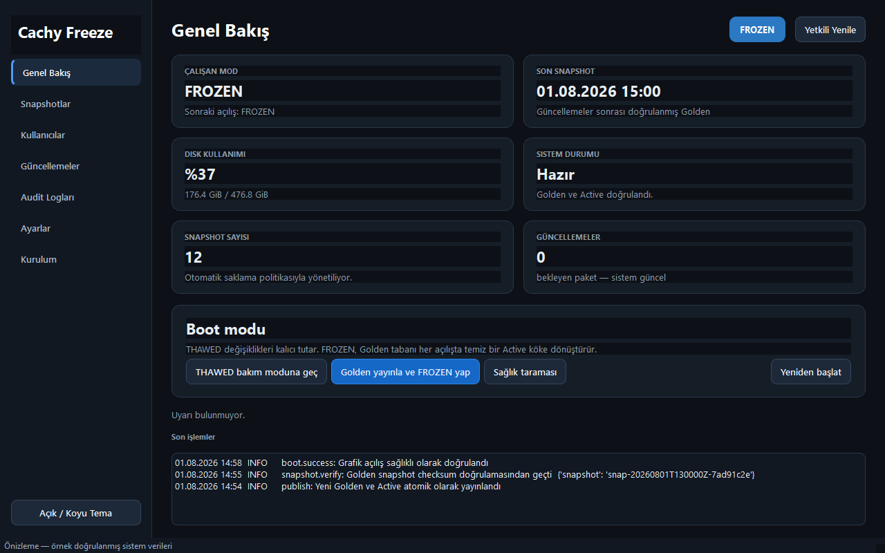

<p align="center">
  
</p>

<h1 align="center">CachyFreeze</h1>

[](VERSION)
[](https://github.com/q0xs/cachy-freeze/actions/workflows/static-tests.yml)
[](LICENSE)
[](https://cachyos.org/)

CachyFreeze is a graphical Btrfs freeze and recovery manager for managed
CachyOS workstations. It keeps a persistent THAWED maintenance system, a
verified Golden baseline, and a disposable FROZEN daily runtime.



> [!CAUTION]
> CachyFreeze changes Btrfs subvolumes, initramfs, GRUB, and the boot process.
> Use a backed-up pilot device with physical access and recovery media.

## Highlights

- FROZEN boots recreate `@active` from read-only `@golden`.
- THAWED maintenance boots the persistent `@` subvolume.
- Golden publication waits for managed sessions to log out and fails closed if
  users or processes do not stop cleanly.
- Finalization restores managed homes from their existing clean templates so
  session artifacts are never promoted into Golden.
- The first real FROZEN boot is validated before setup is marked complete.
- The managed account can be preselected at the login screen while password
  authentication remains mandatory; CachyFreeze disables automatic login.
- GRUB protects THAWED maintenance with the fixed GRUB username `cachyadmin`;
  FROZEN is passwordless.
- Users are provisioned only after the verified application set is installed.
- English and Turkish UI translations, redacted diagnostics, versioned state,
  migrations, backups, and allow-listed rollback are included.

## Automatic idle power policy

When enabled during installation, CachyFreeze applies this fixed policy:

1. One hour without keyboard or pointer activity → timed sleep.
2. One further unattended hour asleep → RTC wake and automatic poweroff.
3. Manual early wake → shutdown is cancelled and a new idle cycle is required.

The policy requires a writable RTC wake alarm at
`/sys/class/rtc/rtc0/wakealarm`. Without RTC support, the freeze engine remains
safe and the policy reports itself as unavailable instead of suspending without
a reliable shutdown deadline.

## Requirements

- CachyOS/Arch Linux with KDE Plasma
- UEFI firmware and GRUB
- Btrfs root using the `@` subvolume
- EFI system partition mounted at `/boot/efi`
- no separate `/boot` filesystem
- an existing `localadm` administrator account
- AC power, recovery media, and a restorable backup

Unsupported layouts include ext4, BIOS, systemd-boot, and custom Btrfs layouts.

## Installation

The supported end-user path is graphical:

1. Download the complete archive with **Code → Download ZIP** or use the
   [CachyFreeze ZIP](https://github.com/q0xs/cachy-freeze/archive/refs/heads/main.zip).
2. Extract it completely; do not run files from inside the ZIP preview.
3. Open [`cachyfreeze-setup.desktop`](cachyfreeze-setup.desktop) and choose
   **Execute** if KDE asks.
4. Run **Preflight**, confirm backup/recovery readiness or disposable-device
   use, then select **Install CachyFreeze**.

Installation leaves the next boot in safe THAWED maintenance mode.

## First workstation setup

The Setup page presents one vertical, five-step workflow:

1. Run the system preflight.
2. Install CachyFreeze.
3. Optionally create a standard user. CachyFreeze prepares required applications
   when needed, then asks for the account details.
4. Set the GRUB maintenance password for the fixed `cachyadmin` username.
5. Finish and enable FROZEN.

User creation does not publish Golden, change boot mode, or reboot the machine.
The optional login selection highlights the managed user at the login screen but
never bypasses password authentication. CachyFreeze explicitly disables its old
automatic-login drop-ins before Golden publication.

## Boot model

| Subvolume | Role |
| --- | --- |
| `@` | Persistent THAWED maintenance root |
| `@golden` | Read-only known-good baseline |
| `@active` | Disposable FROZEN runtime |
| `@cachy-state` | Persistent settings, audit, health, and transaction state |
| `@cachy-snapshots` | Managed recovery snapshots |

## Validation

```bash
ruff check src app/cachy_freeze_gui tests
ruff format --check src app/cachy_freeze_gui tests
PYTHONPATH=src:app python -m unittest discover -s tests -v
SHELLCHECK_OPTS=--severity=error bash deepfreeze/tests/static.sh
QT_QPA_PLATFORM=offscreen bash deepfreeze/tests/ui-smoke.sh
bash deepfreeze/tests/grub-generation.sh
bash deepfreeze/tests/boot-acceptance-vm.sh
```

The UEFI acceptance test runs disposable OVMF/QEMU guests for wrong-password
THAWED, correct-password THAWED, and passwordless FROZEN scenarios. Physical
boot, recovery, suspend, poweroff, and power-loss tests require a disposable
target or explicit pilot-device approval.

## Documentation

- [Installation guide](docs/installation.md)
- [Architecture](docs/architecture.md)
- [Boot recovery](docs/boot-recovery.md)
- [Development workflow](docs/development.md)
- [Test evidence](docs/testing/TEST-LOG.md)

## License

Copyright 2026 Atilla Mert Akkaya. Licensed under the Apache License 2.0.
See [LICENSE](LICENSE) and [NOTICE](NOTICE).
